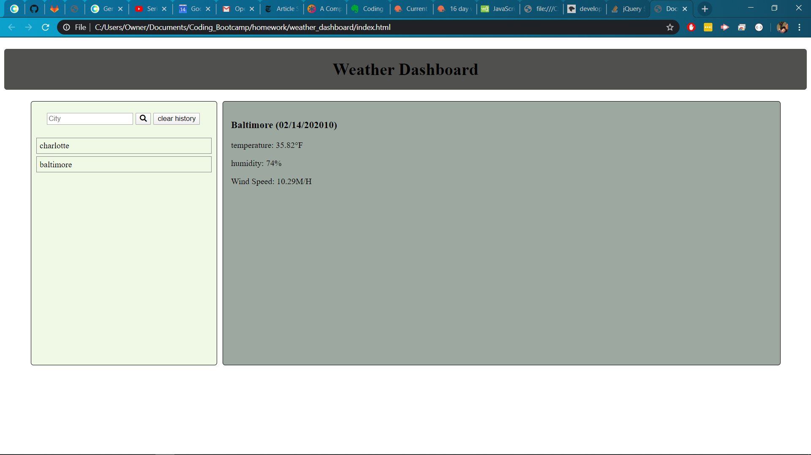

# weather_dashboard
This is a simple weather app where user can inpute the name of a city and will find current weather in that city. past searches are saved to local storage with a max of 11 past searches, and when past searches are clicked it will rerun the search for that area.

[link to github page](https://github.com/Daniel-Droppa/weather_dashboard)

